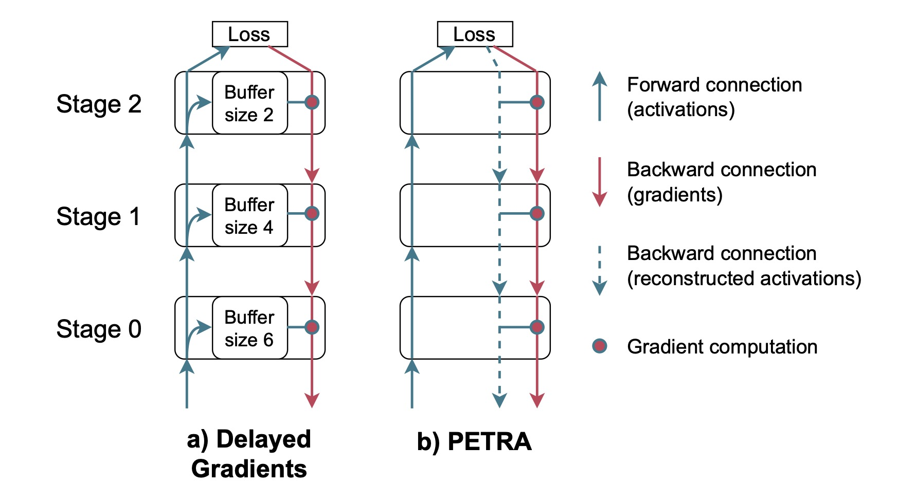

# Async-Grad

Your new tool for asynchronous deep learning

## Description

This repository contains the code to reproduce the results presented in "PETRA: Parallel End-to-end Training with Reversible Architectures". (Link available soon)

<div style="text-align: center;">
   
</div>

## Requiremets

```sh
pip install pytorch
```

## Usage

```sh
python main.py --dataset DATASET --batch-size BATCH_SIZE -p PRINT_FREQUENCY --workers WORKERS --model MODEL \
[--synchronous] [--store-vjp] [remove-ctx-input] [--remove-ctx-param] [--approximate-input] \
--accumulation-steps ACCUMULATION_STEPS [--accumulation-averaging] \
--optimizer OPTIMIZER --lr LEARNING_RATE --weight-decay WEIGHT_DECAY [--no-bn-weight-decay] [--nesterov] \
--scheduler steplr --max-epoch NUM_EPOCHS --warm-up NUM_WARMUP_EPOCHS --lr-decay-fact LR_DECAY_FACTOR --lr-decay-milestones LR_DECAY_MILESTONES [--goyal-lr-scaling]
```


1. To reproduce the CIFAR-10 results for revnet18:
    ```sh
    python main.py --no-git --dataset cifar10 --batch-size 64 -p 78 --workers 4 --model revnet18 --synchronous --optimizer sgd --lr 0.1 --weight-decay 0.0005 --no-bn-weight-decay --nesterov --store-vjp --remove-ctx-input --remove-ctx-param --accumulation-steps 2 --accumulation-averaging --goyal-lr-scaling --scheduler steplr --max-epoch 300 --warm-up 5 --lr-decay-fact 0.1 --lr-decay-milestones 150 225
    python main.py --no-git --dataset cifar10 --batch-size 64 -p 78 --workers 4 --model revnet18 --optimizer sgd --lr 0.1 --weight-decay 0.0005 --no-bn-weight-decay --nesterov --remove-ctx-input --remove-ctx-param --accumulation-steps 2 --accumulation-averaging --goyal-lr-scaling --scheduler steplr --max-epoch 300 --warm-up 5 --lr-decay-fact 0.1 --lr-decay-milestones 150 225
    ```

2. To reproduce the ImageNet32 results for revnet34:
    ```sh
    python main.py --no-git --dataset imagenet32 --dir [PATH TO DATASET] --batch-size 64 -p 2001 --workers 4 --model revnet34 --synchronous --optimizer sgd --lr 0.1 --weight-decay 0.0001 --no-bn-weight-decay --nesterov --store-vjp --remove-ctx-input --remove-ctx-param --accumulation-steps 2 --accumulation-averaging --goyal-lr-scaling --scheduler steplr --max-epoch 90 --warm-up 5 --lr-decay-fact 0.1 --lr-decay-milestones 30 60 80
    python main.py --no-git --dataset imagenet32 --dir [PATH TO DATASET] --batch-size 64 -p 2001 --workers 4 --model revnet34 --optimizer sgd --lr 0.1 --weight-decay 0.0001 --no-bn-weight-decay --nesterov --remove-ctx-input --remove-ctx-param --accumulation-steps 2 --accumulation-averaging --goyal-lr-scaling --scheduler steplr --max-epoch 90 --warm-up 5 --lr-decay-fact 0.1 --lr-decay-milestones 30 60 80
    ```
3. To reproduce the ImageNet results for revnet50:
    ```sh
    python main.py --no-git --dataset imagenet --dir [PATH TO DATASET] --batch-size 64 -p 2001 --workers 16 --model revnet50 --synchronous --optimizer sgd --lr 0.1 --weight-decay 0.0001 --no-bn-weight-decay --nesterov --store-vjp --remove-ctx-input --remove-ctx-param --accumulation-steps 4 --accumulation-averaging --goyal-lr-scaling --scheduler steplr --max-epoch 90 --warm-up 5 --lr-decay-fact 0.1 --lr-decay-milestones 30 60 80
    python main.py --no-git --dataset imagenet --dir [PATH TO DATASET] --batch-size 64 -p 2001 --workers 16 --model revnet50 --optimizer sgd --lr 0.1 --weight-decay 0.0001 --no-bn-weight-decay --nesterov --remove-ctx-input --remove-ctx-param --accumulation-steps 4 --accumulation-averaging --goyal-lr-scaling --scheduler steplr --max-epoch 90 --warm-up 5 --lr-decay-fact 0.1 --lr-decay-milestones 30 60 80
    ```
